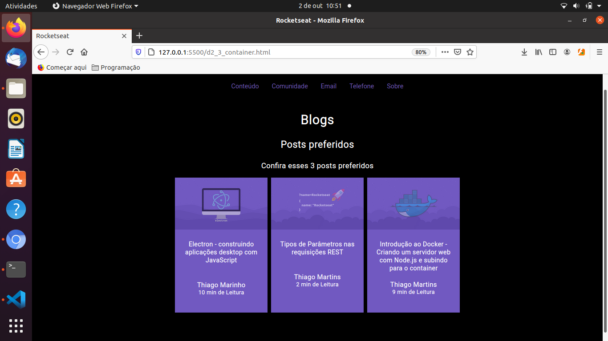
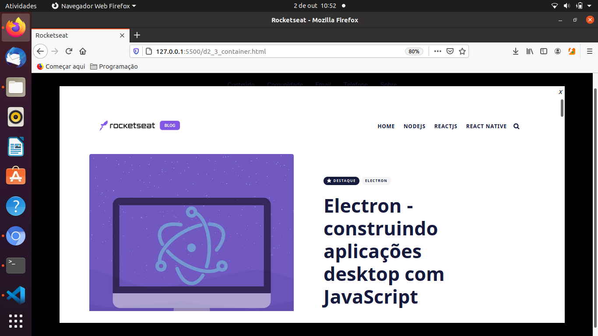

<h1 align="center"></h1>

<p align="center">-<green>"> -<green>"> -<green>"> -<green>"></p>

### Indice
<!--ts-->
* [Indice](#indice)
* [Sobre](#sobre)
* [Status do Projeto](#status-do-projeto)
* [Features](#features)
* [Demonstração da Aplicação](#demonstração-da-aplicação)
* [Pré-requisitos](#pré-requisitos)
* [Testes](#testes)
* [Tecnologias Utilizadas](#tecnologias-utilizadas)
* [Autor](#autor)
* [Licença](#licença)
<!--te-->

### Sobre

<p align="center">Review - Criação de um site com links, menu, pop-up(iframe), posts. Desafios propostos pela Rocketseat no Bootcamp Launchbase:</p>
<ul >
 <li><a href="https://github.com/rocketseat-education/bootcamp-launchbase-desafios-02/blob/master/desafios/02-1-primeiro-html.md" target="_blank">Desafio 2.1;</a></li>
 <li><a href="https://github.com/rocketseat-education/bootcamp-launchbase-desafios-02/blob/master/desafios/02-2-pagina-descricao.md">Desafio 2.2;</a></li>
<li><a href="https://github.com/rocketseat-education/bootcamp-launchbase-desafios-02/blob/master/desafios/02-3-pagina-cursos-e-iframe.md" target="_blank">Desafio 2.3.</a></li>
</ul>
<p>Detalhes do Projeto:</p>
<ul>
 <li>Criação de arquivo html, menu e links;</li>
 <li>Estililzação - utilização de cores, proporções e funcionalidades (HTML e CSS), que permitem boas experiências para o usuário;</li>
 <li>Criação de Card linkados a posts;</li>
 <li>Ao clicar em um dos posts, deve ser aberta uma modal onde um iframe irá carregar as informações do post selecionado.</li>
</ul>


### Status do Projeto

<h4> 
	👌 Concluído 👌
</h4>


### Features

- [x] Página com menu
- [x] Página Sobre
- [x] Página com conteúdo


### Demonstração da Aplicação

<h1 align="center"></h1>

<h1 align="center"></h1>

Ou acesse a aplicação na <a href="https://dimasdevspro.github.io/Projeto%201%20-%20Portfolio/d2_1_index.html" target="_blank">rede</a>


### Pré-requisitos

Para começar, você vai precisar ter instalado em sua máquina as seguintes ferramentas:

- Um repositório para seu projeto [Git](https://git-scm.com);

- Um editor de código [VSCode](https://code.visualstudio.com/);

- E um servidor de Testes do VSCode [LiveServer](https://ritwickdey.github.io/vscode-live-server/);


### Testes


```bash
# Baixe o editor equivalente para a sua plataforma
$ <https://code.visualstudio.com/>

# Vá para a pasta de downloads e execute o arquivo

# Acesse o terminal/cmd de sua plataforma (Win, Linux, etc)

# Clone este repositório com o seguinte comando abaixo
$ git clone <https://github.com/dimasdevspro/Site_Portifolio_Desafio_2>

# Ainda no terminal, acesse a pasta com mais um comando
$ cd Site_Portifolio_Desafio_2

# Agora digite este comando, para editar/testas o projeto
$ code .

# No menu lateral do VSCode, acesse "Extensions"

# Digite na busca "Live Server e clique em install

# No menu lateral do VSCode, acesse "Explorer"

# Escolha o arquivo "...index.html" e clique com o botão
# direito do mouse e escolha a opção "Open Live Server"
# ou execute o comando no teclado
$ Alt+L Alt+O

```


### Tecnologias utilizadas

As seguintes ferramentas foram usadas na construção do projeto:

- [VSCode](https://code.visualstudio.com/)
- [Git](https://git-scm.com)


### Autor

---

<a href="https://github.com/dimasdevspro">
 
 <br />
 <sub><b>Dimas Alves Pereira</b></sub></a> <a href="https://github.com/dimasdevspro" title="Github"></a>


Feito com ❤️ por Dimas 👋🏽 Entre em contato!

[](https://www.instagram.com/dimasdevspro/) [](https://www.linkedin.com/in/dimas-apereira/) 
[](mailto:dimasdevspro@gmail.com)


### Licença

